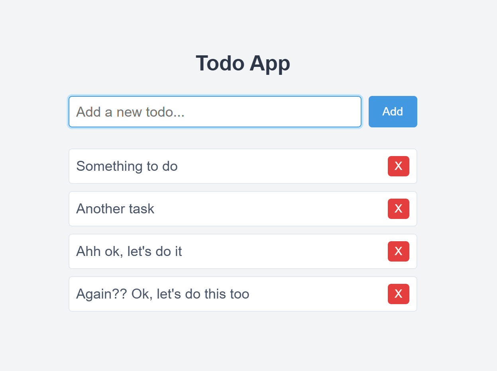

# Learn Redux - An Overview by Renato Lins

Redux was introduced by Dan Abramov and Andrew Clark in 2015, inspired by the Flux architecture, with the goal of managing the state of JavaScript applications in a predictable and centralized manner. It was designed to simplify state management by enforcing a unidirectional data flow, making complex applications easier to debug and reason about. Since its inception, Redux has evolved into a widely-adopted state management library, primarily used with React but also adaptable to other JavaScript frameworks. Its principles have influenced numerous other tools and libraries, underscoring its importance in modern web development.

## Table of Contents

- [1. Introduction to Redux](#1-introduction-to-redux)
- [2. Understanding Applications as State Machines](#2-understanding-applications-as-state-machines)
- [3. The Flux Architecture: Origins, Influence on Redux, and Key Differences  ](#3-the-flux-architecture-origins-influence-on-redux-and-key-differences-)
- [4. How to Use Redux in a React Application (Traditional Redux)](#4-how-to-use-redux-in-a-react-application-traditional-redux)
- [5. Using React's Context API to Mimic Redux](#5-using-reacts-context-api-to-mimic-redux)
- [6. Redux Toolkit: A Simplified, Powerful and Modern Approach to Redux](#6-redux-toolkit-a-simplified-powerful-and-modern-approach-to-redux)
- [7. Debugging Redux with Redux DevTools](#7-debugging-redux-with-redux-devtools)
- [8. Conclusion](#8-conclusion)

---

### 1. Introduction to Redux

In modern web applications, managing state—the data that represents the current status of an application—can become increasingly difficult as the app grows in complexity. This is especially true when multiple components need to access or update the same pieces of data. Some of the common challenges developers face include:  

1. **State Scattering**: When state is maintained in multiple places (e.g., individual component states), it can be hard to track how data changes and flows through the application.  
2. **Unexpected Changes**: Without a clear structure, different parts of the application may accidentally modify shared state, leading to bugs that are hard to debug.  
3. **Asynchronous Operations**: Tasks like fetching data from an API can complicate state management when multiple asynchronous updates happen at once.  
4. **Debugging Complexity**: With state scattered and frequently updated in inconsistent ways, identifying the root cause of a bug becomes tedious.  

Redux addresses these issues by providing a **centralized state container**. Instead of each component managing its own state independently, Redux consolidates all state in a single, predictable object. This centralization simplifies tracking and updating state across the application.

**Core Principles of Redux:**  

1. **Immutability**:  

   In Redux, the state is **immutable**, meaning it cannot be modified directly. Instead, any changes to the state result in the creation of a new version of the state. This ensures that:  

   - Changes to the state are predictable and traceable.  
   - The history of state changes can be preserved, which is useful for debugging tools like time-travel debugging.  

2. **Predictability**:  

   Redux enforces a strict structure for how state changes occur. Updates are only made through **pure functions** (reducers), which take the current state and an action as input and return the next state. This makes the behavior of the application predictable, as the same input will always produce the same output.  

3. **Unidirectional Data Flow**:  

   Redux uses a unidirectional data flow:  
   - Actions describe "what happened."  
   - Reducers determine "how the state should change."  
   - The updated state is sent to the application to render the changes.  
   This structure eliminates confusion about how data flows, making it easier to follow and debug state changes.  

**Why Redux is Useful:**  

1. **Ease of Debugging**:  

   Redux keeps a clear record of every action that modified the state. This makes it easier to:  
   - Reproduce bugs by replaying specific sequences of actions.  
   - Inspect what changes occurred and when they happened.  

2. **Consistency in State Management**:  

   Since Redux centralizes and standardizes how state is managed, it ensures consistency across the application. Every state update follows the same rules, reducing the likelihood of unexpected side effects.  

3. **Scalability**:  

   For small applications, managing state with local component state or React’s Context API might be sufficient. However, as applications grow in complexity, Redux provides a structured approach that scales effectively. It becomes easier to organize and maintain state logic even in large codebases with many contributors.  

4. **Powerful Tooling**:  

   Redux comes with tools like the **Redux DevTools**, which allow developers to visualize state changes in real-time, inspect the sequence of actions, and even "time travel" by rolling the application state backward and forward.  

---

### 2. Understanding Applications as State Machines

A **state machine** is a conceptual model for managing the different "states" an application or system can be in and how it transitions from one state to another. At its core, a state machine has:  

1. **A Set of States**: These represent all the possible configurations the system can be in at any given moment.  
2. **Transitions**: These define how the system moves from one state to another based on certain events or inputs.  
3. **Events/Actions**: External triggers or commands that initiate a transition.  

For example, consider a login form in a web application:  

- **States**:  
  - Logged out  
  - Logging in  
  - Logged in  
  - Login error  

- **Transitions**:  
  - When the user submits their credentials (event), the state moves from "logged out" to "logging in"  
  - If the server verifies the credentials successfully, the state moves to "logged in"  
  - If verification fails, the state transitions to "login error"  

The state machine concept is crucial because it simplifies reasoning about complex systems by breaking them into manageable and predictable pieces.  

**How Redux Formalizes State Management:**  

Redux is, in essence, a **state machine framework** designed for JavaScript applications. It adapts the principles of state machines to provide a predictable way to manage state transitions across an entire application. Let’s break down how Redux achieves this:  

1. **State in Redux**:  
   The **state** in Redux represents the current "snapshot" of the application’s data. This state is stored centrally in a single object, making it easy to access and track.  

2. **Actions as Events**:  
   In Redux, **actions** are the "events" that describe what has occurred. For example:  
   - An action like `{ type: 'LOGIN_REQUEST' }` signals that a user has started the login process.  
   - Another action, like `{ type: 'LOGIN_SUCCESS', payload: { userId: 123 } }`, represents the server verifying the login.  

   Actions do not update the state directly; they merely describe the event.  

3. **Reducers as Transition Functions**:  
   A **reducer** is a pure function that determines how the application state transitions from one state to the next based on an action. It acts as the "brain" of the state machine, deciding what the new state should be.  
   - For example, given the current state `{ isLoggedIn: false }` and the action `{ type: 'LOGIN_SUCCESS' }`, the reducer will return the updated state `{ isLoggedIn: true, userId: 123 }`.  

   By following the principle of immutability, reducers ensure that each state transition creates a new state object without modifying the previous one.  

4. **Predictability Through Formalized Transitions**:  
   Since state transitions are explicitly defined by reducers and triggered only by actions, Redux ensures that the application state evolves in a predictable manner. There are no hidden state changes—everything is traceable and visible.  

---

### 3. The Flux Architecture: Origins, Influence on Redux, and Key Differences  

Flux is a design pattern introduced by Facebook to manage the flow of data in JavaScript applications. It was created to address the complexity of state management in large applications, especially when dealing with multiple views and shared data. Flux organizes application data flow in a unidirectional pattern, which helps prevent state inconsistencies and makes the data flow easier to reason about.  

**Core Components of Flux:**  

1. **Action**:  
   - A plain JavaScript object or function that describes "what happened."  
   - For example, an action might indicate that a user clicked a button or submitted a form.  

2. **Dispatcher**:  
   - A central hub that broadcasts actions to registered callbacks.  
   - All state updates must pass through the dispatcher, ensuring a controlled flow of updates.  

3. **Store**:  
   - Stores hold the state of the application.  
   - Each store listens to specific actions and updates its state accordingly.  
   - In Flux, multiple stores can exist, and they may depend on each other to process an action.  

4. **View**:  
   - The UI components that render data from the stores.  
   - Views listen for changes in the stores and re-render to reflect the updated state.  

**How Flux Works:**  

Flux enforces **unidirectional data flow**, meaning data flows in a single direction through the following cycle:  

1. **User Interaction (Action)**: The user interacts with the UI, triggering an action.  
2. **Action Dispatching**: The action is sent to the dispatcher, which broadcasts it to all the stores.  
3. **State Update (Store)**: Stores respond to the action, update their state, and emit a change event.  
4. **UI Update (View)**: The views re-render based on the updated state in the stores.  

This cycle ensures that every state change is predictable and traceable.

**How Flux Inspired Redux:**  

Redux draws heavily from Flux's principles but simplifies and formalizes its approach, addressing several pain points in the original architecture. Here's how Redux is inspired by Flux:  

1. **Unidirectional Data Flow**:  
   Redux retains Flux’s core principle of unidirectional data flow, ensuring a predictable sequence of updates.  

2. **Actions**:  
   Just like in Flux, Redux uses actions to describe changes in the application. These actions are dispatched to update the state.  

3. **Centralized State**:  
   Redux takes Flux’s concept of "stores" but consolidates everything into a **single store**, making state management more centralized and straightforward.  

4. **Predictable State Changes**:  
   In both Flux and Redux, state changes are not arbitrary—they follow a strict set of rules. In Redux, this is formalized through **reducers**.  

**Key Differences Between Flux and Redux:**  

| **Aspect**               | **Flux**                                                                                        | **Redux**                                                                                     |  
|--------------------------|-------------------------------------------------------------------------------------------------|-----------------------------------------------------------------------------------------------|  
| **State Management**     | Multiple stores, each responsible for part of the application’s state.                          | A single store that holds the entire state of the application.                                |  
| **Dispatcher**           | Uses a dispatcher to broadcast actions to stores.                                               | No dispatcher; actions are sent directly to reducers through `dispatch()`.                    |  
| **Reducers**             | Not a part of Flux; state updates happen within store-specific logic.                           | Explicitly uses reducers—pure functions that define how state updates occur based on actions. |  
| **Immutability**         | Flux does not enforce immutability; stores can mutate their state directly.                     | Redux enforces immutability; state updates result in new objects.                             |  
| **Middleware Support**   | Not built-in; requires custom implementation.                                                   | Built-in middleware support, allowing control over asynchronous actions and side effects.     |  
| **Boilerplate**          | Can involve significant boilerplate for setting up multiple stores and dispatcher callbacks.    | Simplifies boilerplate by consolidating logic, especially with Redux Toolkit.                 |  

So we have:

**Flux Data Flow:**  

```
[Action] --> [Dispatcher] --> [Store] --> [View] --> [Action]
```

- An **Action** is triggered (e.g., user clicks a button).  
- The **Dispatcher** sends the action to all **Stores**.  
- The **Stores** update their state based on the action.  
- The **View** listens to the store updates and re-renders accordingly.  
- If the user interacts with the updated **View**, a new **Action** is triggered, restarting the flow.  

**Redux Data Flow**  

```
[Action] --> [Reducer] --> [Store] --> [View] --> [Dispatch (Action)]
```

- An **Action** is dispatched to describe what happened (e.g., adding a new to-do).  
- The **Reducer** processes the action and returns a new state.  
- The **Store** holds the updated state.  
- The **View** subscribes to the **Store** and re-renders when the state changes.  
- When the user interacts with the **View**, it dispatches a new **Action**, restarting the flow.  

**Why Redux Evolved from Flux:**  

While Flux introduced a robust architecture for state management, it had several challenges:  
1. **Multiple Stores**:  
   Managing interdependencies between multiple stores in Flux could be complex, leading to tightly coupled code. Redux simplifies this by using a single store.  

2. **Dispatcher Complexity**:  
   The dispatcher in Flux could become difficult to manage in larger applications. Redux eliminates the dispatcher entirely and relies on reducers to handle state changes.  

3. **Scalability Issues**:  
   Flux’s architecture could become cumbersome in larger projects due to the lack of a standard approach to handling complex state transitions and asynchronous operations. Redux, especially with Redux Toolkit, provides a more structured and scalable solution.  

4. **Predictability and Debugging**:  
   Redux’s strict adherence to immutability and its use of pure functions (reducers) make state transitions predictable, enabling powerful debugging tools like Redux DevTools.  

---

### 4. How to Use Redux in a React Application (Traditional Redux)

Traditional Redux refers to the classic approach of managing state in React applications using Redux. Let’s explore how Redux was traditionally used, highlighting key concepts such as action types, action creators, reducers, and the store. We’ll also discuss the challenges that came with traditional Redux, including boilerplate code, complex async handling, and immutable state updates.

When working with Redux, organizing your project structure is essential for maintaining clarity and scalability. Below is an example of a simple Redux structure, assuming you already have a React application set up and running:

**Project Structure**

```
/src
  /actions
    todoActions.js
  /reducers
    todoReducer.js
  /store
    index.js
  /types
    actionTypes.js
  App.jsx
  main.jsx
```

**File Descriptions**

1. **`/actions/todoActions.js`**  
   Contains action creators that define the type of changes to be made to the state.

2. **`/reducers/todoReducer.js`**  
   Defines the reducer responsible for managing the "todos" state, including how to update it based on dispatched actions.

3. **`/store/index.js`**  
   Configures and creates the Redux store.

4. **`/types/actionTypes.js`**  
   Defines constants for action types to avoid hardcoding strings throughout the app.

Now, let's set up a todo app (as an example) with Redux by following these steps:

**Step 1: Install Redux and React-Redux**

First, we need to install Redux and React-Redux.

```bash
npm install redux react-redux
```

**Step 2: Create Action Types**

Action types define the kind of action that can be dispatched to modify the state. It’s a best practice to store these types as constants to avoid errors from misspelling.

```javascript
// src/types/actionTypes.js
export const ADD_TODO = "ADD_TODO";
export const REMOVE_TODO = "REMOVE_TODO";
```

**Step 3: Create Action Creators**

Action creators are functions that return an action object. The action object includes a type (the action type) and any necessary data (like a payload).

```javascript
// src/actions/todoActions.js
import { ADD_TODO, REMOVE_TODO } from "../types/actionTypes";

export const addTodo = (text) => ({
  type: ADD_TODO,
  payload: text,
});

export const removeTodo = (id) => ({
  type: REMOVE_TODO,
  payload: id,
});
```

**Step 4: Write the Reducer**

Reducers are pure functions that take the current state and an action, then return the new state. They define how the state changes in response to actions.

```javascript
// src/reducers/todoReducer.js
import { ADD_TODO, REMOVE_TODO } from "../types/actionTypes";

const initialState = {
  todos: [],
};

const todoReducer = (state = initialState, action) => {
  switch (action.type) {
    case ADD_TODO:
      return {
        ...state,
        todos: [...state.todos, { id: Date.now(), text: action.payload }],
      };
    case REMOVE_TODO:
      return {
        ...state,
        todos: state.todos.filter((todo) => todo.id !== action.payload),
      };
    default:
      return state;
  }
};

export default todoReducer;
```

**Step 5: Create the Redux Store**

To initialize Redux, we need to create the store using the `createStore` function and pass it the reducer.

```javascript
// src/store/index.js
import { createStore } from "redux";
import todoReducer from "../reducers/todoReducer";

const store = createStore(todoReducer);

export default store;
```

**Step 6: Provide the Store to the React Application**

To link Redux with React, we’ll wrap the entire application in the `Provider` component from `react-redux`, passing the Redux store to it.

```javascript
// src/main.jsx
import App from './App.jsx'
import store from "./store";
import { StrictMode } from 'react'
import { Provider } from "react-redux";
import { createRoot } from 'react-dom/client'

createRoot(document.getElementById('root')).render(
  <StrictMode>
     <Provider store={store}>
    <App />
    </Provider>
  </StrictMode>,
)
```

**Step 7: Interacting with the store via the UI: Selecting state and dispatching actions**

Now, let’s implement the todo functionality in our app by accessing the state and dispatching actions through the application's UI. To make the example clear, we’ll create a functional to-do app.

```javascript
// src/App.jsx
import './App.css';
import { useState } from 'react';
import { useSelector, useDispatch } from 'react-redux';
import { addTodo, removeTodo } from '../src/actions/todoActions';

const App = () => {
  const [currentToDoText, setCurrentToDoText] = useState('');
  const todos = useSelector((state) => state.todos);
  const dispatch = useDispatch();

  const onAdd = () => {
    if (currentToDoText.trim()) {
      dispatch(addTodo(currentToDoText));
      setCurrentToDoText('');
    }
  };

  const handleRemoveTodo = (id) => {
    dispatch(removeTodo(id));
  };

  const handleCurrentTextChange = (e) => {
    setCurrentToDoText(e.target.value);
  };

  const handleKeyPress = (e) => {
    if (e.key === 'Enter') {
      onAdd();
    }
  };

  return (
    <div className="app-container">
      <h1 className="app-title">Todo App</h1>
      <div className="input-container">
        <input
          type="text"
          className="todo-input"
          onChange={handleCurrentTextChange}
          onKeyPress={handleKeyPress}
          value={currentToDoText}
          placeholder="Add a new todo..."
        />
        <button
          className="add-button"
          onClick={onAdd}
        >
          Add
        </button>
      </div>
      <ul className="todo-list">
        {todos.map((todo) => (
          <li
            key={todo.id}
            className="todo-item"
          >
            <span className="todo-text">{todo.text}</span>
            <button
              className="delete-button"
              onClick={() => handleRemoveTodo(todo.id)}
            >
              X
            </button>
          </li>
        ))}
      </ul>
    </div>
  );
};

export default App;
```

**Step 8 (Optional): Adding styles**

If we want to elaborate further (for example, adding the app as a portfolio piece), we could start with the following styles:

```css
/* App.css */
.app-container {
  font-family: sans-serif;
  display: flex;
  flex-direction: column;
  align-items: center;
  justify-content: center;
  height: 100vh;
  background-color: #f3f4f6;
}

.app-title {
  font-size: 24px;
  font-weight: bold;
  color: #2d3748;
  margin-bottom: 24px;
}

.input-container {
  display: flex;
  width: 100%;
  max-width: 400px;
  gap: 8px;
  margin-bottom: 24px;
}

.todo-input {
  flex: 1;
  padding: 8px;
  font-size: 16px;
  border: 1px solid #cbd5e0;
  border-radius: 4px;
  outline: none;
}

.todo-input:focus {
  border-color: #4299e1;
  box-shadow: 0 0 0 2px #bee3f8;
}

button {
  border: none;
  border-radius: 4px;
  cursor: pointer;
  transition: background-color 0.3s ease;
}

.add-button {
  background-color: #4299e1;
  color: white;
  padding: 8px 16px;
  border-radius: 4px;
}

.delete-button {
  color: white;
  padding: 4px 8px;
  background-color: #e53e3e;
}


.add-button:hover {
  background-color: #3182ce;
}

.todo-list {
  width: 100%;
  max-width: 400px;
  list-style-type: none;
  padding: 0;
  margin: 0;
}

.todo-item {
  display: flex;
  justify-content: space-between;
  align-items: center;
  padding: 8px;
  background-color: white;
  border: 1px solid #e2e8f0;
  border-radius: 4px;
  margin-bottom: 8px;
}

.todo-text {
  color: #4a5568;
}

.delete-button:hover {
  background-color: #c53030;
}
```

The result will be something like this:



Having a functional app that is also visually structured will help us think of and try enhancements. In the case of this app, we could consider editing, sorting, adding tags, searching, etc.

**Challenges with Traditional Redux:**

While Redux provides a robust state management solution, it comes with some challenges:

1. **Boilerplate Code**:  
   Creating separate files for action types, action creators, and reducers can feel repetitive and result in a lot of boilerplate code. Managing actions and reducers for every slice of state can become cumbersome.

2. **Managing Async Code**:  
   Managing asynchronous actions (e.g., API calls) requires extra middleware like `redux-thunk` or `redux-saga`. This adds complexity to the application.

3. **Immutable State Updates**:  
   Redux requires that the state is never mutated directly. Instead, you need to return a new object with the updated state. While this enforces immutability, it can be cumbersome without tools like **Immer**.

4. **Scaling State with Slices**:  
   As applications grow, managing state in multiple reducers and combining them can become harder to maintain.

---

### 5. Using React's Context API to Mimic Redux

React’s Context API is a powerful feature that allows us to share state across the component tree without passing props down manually at every level. While it can be a valid alternative to Redux for state management, it has its own strengths and limitations, especially when it comes to larger applications. Next, we’ll explore the pros and cons of using the Context API to mimic Redux and how it compares to the more structured approach Redux offers.

**Pros of Using the Context API:**

1. **Simplicity and Less Boilerplate**

   One of the most significant advantages of the Context API is its simplicity. React's Context API is built right into React, meaning you don’t need to install any third-party libraries. Unlike Redux, which requires setting up reducers, actions, and action creators, the Context API allows you to manage state with just a few lines of code. This makes it a great option for smaller projects or when you're just getting started with state management in React.

2. **No External Dependencies**

   The Context API is part of React itself, so you don’t need to add external libraries like Redux to your project. This reduces the number of dependencies and keeps your project lighter, especially when you don’t need the full power of Redux for complex state management.

3. **Built-In Solution for React**

   Since the Context API is a native React feature, it integrates well into the React ecosystem. Developers who are already familiar with React’s hooks, such as `useState`, `useEffect`, and `useContext`, don’t have to learn additional tools or concepts to start using the Context API effectively.

4. **Ideal for Small to Medium-Sized Projects**

   If you are working on a small or medium-sized project where you only need to share state across a few components, the Context API can be a perfect fit. It allows for efficient state sharing without introducing unnecessary complexity.

**Cons of Using the Context API:**

1. **Performance Issues with Large Apps**

   A major drawback of the Context API is its potential impact on performance, especially in large applications. Every time the context value changes, React will trigger a re-render for all components that consume that context. In deep component trees or highly dynamic applications, this can lead to performance bottlenecks. 

   Redux, on the other hand, offers more optimized re-rendering through features like the `connect` function in `react-redux`, which prevents unnecessary re-renders by only updating components that are directly affected by state changes.

2. **Lack of Middleware and DevTools**

   One of the core features of Redux is its ecosystem, which includes powerful middleware (e.g., `redux-thunk` for handling async actions) and developer tools like Redux DevTools. These tools allow for better debugging and tracking of state changes. The Context API lacks this robust middleware and debugging ecosystem, so if you need features like action logging or sophisticated async management, you’ll need to implement them yourself.

3. **State Management Becomes Cumbersome as the App Grows**

   While the Context API is fine for smaller apps, it becomes harder to manage state in larger applications with many shared states and interactions. Without the structured flow of Redux (with actions, reducers, and a clear state management pattern), it can become difficult to keep track of how the state is updated and propagated across components.

4. **Not Optimized for Complex State Interactions**

   As your app’s state management needs grow in complexity, managing those interactions using the Context API can become unwieldy. Redux provides a predictable, unidirectional flow of data through actions, reducers, and stores, which makes it easier to scale and debug. The Context API, while useful for simpler applications, may struggle to handle intricate state changes efficiently.

To have the Context API handle state management similarly to Redux, we can implement it as follows:

**Project Structure**

```
/src
  /context
    TodoContext.jsx
  /actions
    TodoActions.js
  /App.jsx
  main.jsx
```

**File Descriptions**

1. **`/context/TodoContext.jsx`**  
   This file contains the context, provider, and state management logic for the Todo app.

2. **`/actions/TodoActions.js`**  
   Functions that define and trigger actions to change the state.

Once the structure is set up, we can proceed with the following steps:

**Step 1: Create the Todo Context**

First, let's create the context and a provider to manage our state.

```javascript
// src/context/TodoContext.jsx
import React, { createContext, useReducer, useContext } from 'react';

const TodoContext = createContext();

const ADD_TODO = "ADD_TODO";
const REMOVE_TODO = "REMOVE_TODO";

const initialState = {
  todos: [],
};

const todoReducer = (state, action) => {
  switch (action.type) {
    case ADD_TODO:
      return {
        ...state,
        todos: [...state.todos, { id: Date.now(), text: action.payload }],
      };
    case REMOVE_TODO:
      return {
        ...state,
        todos: state.todos.filter((todo) => todo.id !== action.payload),
      };
    default:
      return state;
  }
};

export const TodoProvider = ({ children }) => {
  const [state, dispatch] = useReducer(todoReducer, initialState);

  return (
    <TodoContext.Provider value={{ state, dispatch }}>
      {children}
    </TodoContext.Provider>
  );
};

export const useTodoContext = () => useContext(TodoContext);
```

**Step 2: Create Action Creators**

Although we’re not using Redux for action creators, we can still define them as functions to dispatch actions more easily.

```javascript
// src/context/TodoActions.js
export const addTodo = (dispatch, text) => {
  dispatch({ type: "ADD_TODO", payload: text });
};

export const removeTodo = (dispatch, id) => {
  dispatch({ type: "REMOVE_TODO", payload: id });
};
```

**Step 3: Setup the Application Entry Point**

We'll need to wrap the application in the `TodoProvider` to provide the context to the entire app.

```javascript
// src/main.jsx
import App from './App.jsx';
import React, { StrictMode } from 'react';
import { createRoot } from 'react-dom/client';
import { TodoProvider } from './context/TodoContext';

createRoot(document.getElementById('root')).render(
  <StrictMode>
    <TodoProvider>
      <App />
    </TodoProvider>
  </StrictMode>
);
```

**Step 4: Setup the Main Application Component**

Next, we'll integrate the context into the app and create the todo app UI.

```javascript
// src/App.jsx
import './App.css';
import React, { useState } from 'react';
import { useTodoContext } from './context/TodoContext';
import { addTodo, removeTodo } from './actions/TodoActions';

const App = () => {
  const { state, dispatch } = useTodoContext();
  const [currentToDoText, setCurrentToDoText] = useState('');

  const onAdd = () => {
    if (currentToDoText.trim()) {
      addTodo(dispatch, currentToDoText);
      setCurrentToDoText('');
    }
  };

  const handleRemoveTodo = (id) => {
    removeTodo(dispatch, id);
  };

  const handleCurrentTextChange = (e) => {
    setCurrentToDoText(e.target.value);
  };

  const handleKeyPress = (e) => {
    if (e.key === 'Enter') {
      onAdd();
    }
  };

  return (
    <div className="app-container">
      <h1 className="app-title">Todo App</h1>
      <div className="input-container">
        <input
          type="text"
          className="todo-input"
          onChange={handleCurrentTextChange}
          onKeyPress={handleKeyPress}
          value={currentToDoText}
          placeholder="Add a new todo..."
        />
        <button
          className="add-button"
          onClick={onAdd}
        >
          Add
        </button>
      </div>
      <ul className="todo-list">
        {state.todos.map((todo) => (
          <li
            key={todo.id}
            className="todo-item"
          >
            <span className="todo-text">{todo.text}</span>
            <button
              className="delete-button"
              onClick={() => handleRemoveTodo(todo.id)}
            >
              X
            </button>
          </li>
        ))}
      </ul>
    </div>
  );
};

export default App;
```

Note: Since this is a small application, both Traditional Redux and the Context API version should work the same.

**When to Use Context API Over Redux**

While Redux is often preferred for large, complex applications, the Context API may be a better fit in certain scenarios:

- **For smaller apps or apps with low complexity**: If your app has limited state sharing requirements and doesn’t need complex interactions, the Context API is a great lightweight solution.
- **If you want minimal setup**: Since the Context API doesn’t require external dependencies, it’s quicker to implement and easy to use for beginners.
- **For simple global state management**: When you need to manage some simple global state (like a user’s authentication status or theme preference), the Context API can be sufficient.

**When to Use Redux**

Redux shines in applications that require:

- **Complex state management**: If your application has a lot of state shared between components or needs to manage complex interactions, Redux provides a more scalable solution.
- **Asynchronous state handling**: Redux offers middleware like `redux-thunk` and `redux-saga` that simplify handling async actions.
- **Developer tools and debugging**: Redux comes with a powerful set of developer tools that help track state changes, time travel, and debug issues efficiently.

---

### 6. Redux Toolkit: A Simplified, Powerful and Modern Approach to Redux

Redux Toolkit (RTK) was introduced to make state management with Redux easier and more efficient. It addresses the pain points developers face when using traditional Redux by providing tools that simplify common tasks and reduce complexity. Here's how RTK improves the Redux experience:

- **Less Boilerplate**: In traditional Redux, developers often have to write a lot of repetitive code, such as action creators, action types, and reducers. Redux Toolkit simplifies this by allowing you to define actions and reducers together in a **slice** of state. This reduces the amount of code you need to write, making it easier to manage and maintain.

- **Better Async Handling**: Managing asynchronous logic in Redux can be tricky, especially when dealing with actions that involve fetching data from an API or handling side effects. Redux Toolkit introduces **`createAsyncThunk`**, a utility that handles async logic in a clean and standardized way. It automates common patterns for managing async states (like loading, success, and error), making your code less verbose and easier to maintain.

- **Immutable Updates with Immer**: One of the core principles of Redux is that state should be updated immutably, meaning you should never directly modify the state. However, writing immutable code can be verbose and error-prone. Redux Toolkit solves this by integrating **Immer**, which allows you to write code that **appears** to mutate the state, but under the hood, it ensures that state updates are performed immutably. This makes your code simpler and more intuitive.

- **Simplified Store Configuration and management**: Setting up the Redux store traditionally involves a lot of configuration, such as manually adding middleware, integrating DevTools, and applying best practices. With **`configureStore`** from Redux Toolkit, you get a pre-configured store with sensible defaults. This includes automatically adding middleware like **Redux Thunk** for async logic and integrating **Redux DevTools** for debugging, saving you time and ensuring consistency across projects.

**Slices in Redux Toolkit**

A slice, as the name suggests, represents a segment or "slice" of the overall Redux store. It allows us to organize and manage the logic related to a specific feature or domain of the application in an isolated and structured way. While it modularizes the logic, it still adheres to Redux's principle of maintaining a **single source of truth** for the application's state. A slice is created using `createSlice`, which defines:  

- **State**: The initial state for this specific slice of the store.  
- **Reducers**: Functions that describe how the state should be updated in response to specific actions.  
- **Actions**: Automatically generated action creators based on the reducer names.  
- **ExtraReducers**: Logic to handle external actions, often from asynchronous operations like thunks.  

By consolidating state and related logic into a slice, we can create a self-contained module that is easier to manage, debug, and scale, while still integrating seamlessly with the global store.

**Data Flow with Redux Toolkit**

1. **Slice Creation**: 

     - An initial state, such as a list of items, a loading status, and an error field.
     - Reducers for handling synchronous actions.
     - Logic in `extraReducers` to manage state changes triggered by asynchronous actions, such as updating the loading status or saving fetched data.

2. **Dispatching with Thunks**  

   - Asynchronous operations, such as API calls or background processes, are managed using `createAsyncThunk`. 
   - This automatically generates actions for different request states: `pending` (operation started), `fulfilled` (operation succeeded), and `rejected` (operation failed).

3. **Integrated Middleware**  

   - Redux Toolkit includes middleware that handles the execution of thunks, ensuring that the correct sequence of actions (`pending`, `fulfilled`, `rejected`) is dispatched and processed seamlessly.

4. **Reducers and State Updates**: The slice's `extraReducers` respond to the actions generated by the thunk. For example:

     - When the operation is pending, the loading state is updated.
     - On success, the state is updated with the retrieved data.
     - On failure, the error message is stored.

5. **Store Update**  

   - Once the reducers handle the thunk’s results, the store reflects the updated state, including the fetched data, the request status, and any error information.

6. **UI Component Updates**: Components that access the store via `useSelector` automatically update when the state changes. For instance:

     - A loading indicator might show while the operation is in progress.
     - The fetched data is displayed when the operation succeeds.
     - An error message is displayed if the operation fails.

Here's an example of how to implement the same Todo app using Redux Toolkit, incorporating both synchronous and asynchronous operations. Before coding, we need to make sure the essential modules are installed:

```bash
npm install @reduxjs/toolkit react-redux
```

**Project Structure**

```
/src
  /features
    /todos
      todosSlice.js
  /store.js
  /App.jsx
  main.jsx
```

**File Descriptions**

1. **`/features/todos/todosSlice.js`**  
   This file contains the Redux slice for managing todos, including reducers and async actions (via extraReducers).

2. **`/store.js`** 
   This file sets up the Redux store using Redux Toolkit’s configureStore. It combines reducers, integrates middleware (like Redux Thunk), and provides the store to the app.

This structure is sufficient for implementing Redux Toolkit as follows:

**Step 1: Setting Up the Redux Slice**

The first step is to create a slice using Redux Toolkit. This slice will manage the `todos` state and will contain both reducers (for adding and removing todos) and extraReducers (to simulate fetching and saving data asynchronously).

```javascript
// src/features/todos/todosSlice.js
import { createSlice, createAsyncThunk } from '@reduxjs/toolkit';

const serverFakeData = [{ id: 1, text: 'Sample Todo' }];

// Initial state for todos
const initialState = {
  todos: [],
  error: null,
  loading: false,
};

// Simulated async service for fetching and saving todos
const mockApi = {
  fetchTodos: () => {
    return new Promise((resolve) =>
      setTimeout(() => resolve(serverFakeData), 300)
    );
  },
  saveTodo: (todo) => {
    return new Promise((resolve) =>
      setTimeout(() => resolve({ id: Date.now(), text: todo }), 300)
    );
  },
};

// Asynchronous action to fetch todos
export const fetchTodos = createAsyncThunk('todos/fetchTodos', async () => {
  const todos = await mockApi.fetchTodos();
  return todos;
});

// Asynchronous action to add a new todo
export const addTodoAsync = createAsyncThunk(
  'todos/addTodoAsync',
  async (todoText) => {
    const todo = await mockApi.saveTodo(todoText);
    return todo;
  }
);

// Create slice using createSlice
const todosSlice = createSlice({
  name: 'todos',
  initialState,
  reducers: {
    removeTodo: (state, action) => {
      state.todos = state.todos.filter((todo) => todo.id !== action.payload);
    },
  },
  extraReducers: (builder) => {
    // Handling fetchTodos action
    builder
      .addCase(fetchTodos.pending, (state) => {
        state.loading = true;
      })
      .addCase(fetchTodos.fulfilled, (state, action) => {
        state.loading = false;
        state.todos = action.payload;
      })
      .addCase(fetchTodos.rejected, (state, action) => {
        state.loading = false;
        state.error = action.error.message;
      });

    // Handling addTodoAsync action
    builder
      .addCase(addTodoAsync.pending, (state) => {
        state.loading = true;
      })
      .addCase(addTodoAsync.fulfilled, (state, action) => {
        state.loading = false;
        state.todos.push(action.payload);
      })
      .addCase(addTodoAsync.rejected, (state, action) => {
        state.loading = false;
        state.error = action.error.message;
      });
  },
});

export const { removeTodo } = todosSlice.actions;

export default todosSlice.reducer;
```

**Step 2: Setting Up Redux Store**

Now, we need to set up the Redux store to provide the state to our application.

```javascript
// src/store.js
import { configureStore } from '@reduxjs/toolkit';
import todosReducer from './features/todos/todosSlice';

export const store = configureStore({
  reducer: {
    todos: todosReducer,
  },
});
```

**Step 3: Connecting Redux to the App**

We need to provide the Redux store to the app by wrapping the app in a `<Provider>` component.

```javascript
// src/main.jsx
import App from './App';
import React from 'react';
import { store } from './store';
import { Provider } from 'react-redux';
import ReactDOM from 'react-dom/client';

ReactDOM.createRoot(document.getElementById('root')).render(
  <Provider store={store}>
    <App />
  </Provider>
);
```

**Step 4: Implementing the App Component**

Now we can implement the main `App.jsx` component to manage our state.

```javascript
// src/App.jsx
import './App.css';
import React, { useState, useEffect } from 'react';
import { useSelector, useDispatch } from 'react-redux';
import { addTodoAsync, fetchTodos, removeTodo } from './features/todos/todosSlice';

const App = () => {
  const dispatch = useDispatch();
  const { todos, loading, error } = useSelector((state) => state.todos);
  const [todoText, setTodoText] = useState('');

  useEffect(() => {
    dispatch(fetchTodos());
  }, [dispatch]);

  const handleAddTodo = () => {
    if (todoText.trim()) {
      dispatch(addTodoAsync(todoText));
      setTodoText('');
    }
  };

  const handleRemoveTodo = (id) => {
    dispatch(removeTodo(id));
  };

  const handleKeyPress = (e) => {
    if (e.key === 'Enter') {
      handleAddTodo();
    }
  };

  return (
    <div className="app-container">
      <h1 className="app-title">Todo App</h1>
      {loading && <p>Loading...</p>}
      {error && <p>Error: {error}</p>}
      <div className="input-container">
        <input
          type="text"
          className="todo-input"
          value={todoText}
          onChange={(e) => setTodoText(e.target.value)}
          onKeyPress={handleKeyPress}
          placeholder="Add a new todo..."
        />
        <button className="add-button" onClick={handleAddTodo}>Add</button>
      </div>
      <ul className="todo-list">
        {todos.map((todo) => (
          <li key={todo.id} className="todo-item">
            <span className="todo-text">{todo.text}</span>
            <button className="delete-button" onClick={() => handleRemoveTodo(todo.id)}>X</button>
          </li>
        ))}
      </ul>
    </div>
  );
};

export default App;
```

Redux Toolkit significantly simplifies Redux by reducing boilerplate, improving async handling, and making state updates more intuitive. It automates many of the complexities involved in traditional Redux and streamlines the process of setting up and configuring the store. While traditional Redux provides fine-grained control over our state management, Redux Toolkit removes much of the repetitive work, making it the ideal choice for most projects.

---

### 7. Debugging Redux with Redux DevTools

Redux DevTools is an essential tool for debugging Redux applications. It allows you to track dispatched actions, inspect state changes, and even perform time travel debugging to pinpoint issues. With Redux Toolkit, DevTools comes preconfigured, so there's no extra setup needed. It automatically integrates with our store, making it easier to monitor actions and inspect state updates. This integration helps us understand the app’s flow, fix bugs faster, and improve development efficiency. First, make sure that **Redux DevTools** is installed in your browser. It’s available for **Chrome** and **Firefox**. Then we can access Redux DevTools inside browser’s Developer Tools (F12 or right-click → **Inspect**) under the **Redux** tab. Alternatively, you can click the **DevTools icon** if it's pinned to your browser's toolbar.

**State Section in Redux DevTools**

The **State** section shows the current state of your Redux store. With **Redux Toolkit**, your state is organized by the slice name (e.g., `todos`). If your state has a `todos` slice, it might look like this:

```json
{
  "todos": {
    "loading": false,
    "items": [
      { "id": 1, "text": "Learn Redux Toolkit", "completed": false },
      { "id": 2, "text": "Build a Todo App", "completed": true }
    ],
    "error": null
  }
}
```

- **State Structure**: The state is organized into slices. In this case, `todos` holds the state for all to-do-related data.
- **Inspecting State**: You can expand the `todos` slice to see:
  - **`items`**: The array of to-do items.
  - **`loading`**: A flag indicating whether a request to fetch todos is in progress.
  - **`error`**: If an error occurred while fetching todos, this field will show the error message.

**Action Section in Redux DevTools**

In Redux Toolkit, actions are created using `createSlice`, and the action names are automatically prefixed with the slice name. These actions follow the format: `sliceName/actionName/status`, where `status` can be `pending`, `fulfilled`, or `rejected` for async actions.

For example:
- `todos/fetchTodos/pending`: Dispatched when the fetching of todos begins.
- `todos/fetchTodos/fulfilled`: Dispatched when the todos are successfully fetched.
- `todos/fetchTodos/rejected`: Dispatched if fetching the todos fails.

If you dispatch actions such as `todos/fetchTodos/pending`, `todos/fetchTodos/fulfilled`, and `todos/fetchTodos/rejected`, Redux DevTools will show them in the **Actions** section.

```json
{
  "type": "todos/fetchTodos/pending",
  "payload": undefined
}
```

When the todos are successfully fetched:
```json
{
  "type": "todos/fetchTodos/fulfilled",
  "payload": [
    { "id": 1, "text": "Learn Redux Toolkit", "completed": false },
    { "id": 2, "text": "Build a Todo App", "completed": true }
  ]
}
```

By clicking on an action (e.g., `todos/fetchTodos/fulfilled`), you can immediately see how the state changes in the **State** section. For example, after `todos/fetchTodos/fulfilled`, the `todos.items` array will be updated with the fetched to-do list.

**Diff Section in Redux DevTools**

The **Diff** section shows the difference in state before and after an action is dispatched. This helps you easily see what part of the state was changed.

Before dispatching the action:

  ```json
  {
    "todos": {
      "loading": true,
      "items": [],
      "error": null
    }
  }
  ```

After the action (`todos/fetchTodos/fulfilled`):

  ```json
  {
    "todos": {
      "loading": false,
      "items": [
        { "id": 1, "text": "Learn Redux Toolkit", "completed": false },
        { "id": 2, "text": "Build a Todo App", "completed": true }
      ],
      "error": null
    }
  }
  ```

The **Diff** section will highlight the changes in state. In this case, it will show that `todos.items` was updated with the fetched to-do items and that `todos.loading` changed from `true` to `false`. If you see an unexpected state change, the diff will help you pinpoint exactly which action caused the issue.

**Time Travel in Redux DevTools**

Time Travel allows you to navigate through your action history and see how the state evolves over time. How to use it:

- **Rewind and Replay**: You can move backward and forward in the action history, allowing you to see how the state was before and after any specific action (such as `todos/fetchTodos/pending` or `todos/fetchTodos/fulfilled`).
- **Debugging**: If a bug appears after a specific action (for example, after `todos/fetchTodos/fulfilled`), you can jump to that action to see how the state changed and what data was involved.

**Example**: If you are debugging an issue where the to-do list isn't displaying correctly after the fetch operation, you can go back to the `todos/fetchTodos/fulfilled` action and inspect the state before and after.

---

### 8. Conclusion

In applications where data correctness is critical, **Redux Toolkit** provides a robust solution for state management. By centralizing state in a predictable store and enforcing strict patterns for state updates, it ensures consistency and traceability. With tools like `createSlice`, `createAsyncThunk`, and automatic integration with Redux DevTools, Redux Toolkit simplifies setup and promotes clear separation of concerns. This structured approach makes state management scalable and maintainable, while its handling of asynchronous actions and easy debugging features are beneficial for applications of all sizes that require reliable data integrity.
